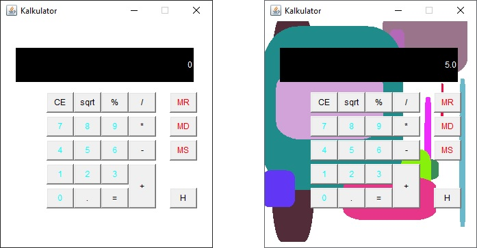

## Overview
A window-based calculator with all the functions of a typical simple calculator and additionally rewarding the user with special effects (creating figures of random shapes and colors) when the result of the actions is equal to any prime number.

## Usage
Compile Kalkulator.java file.

## Results

